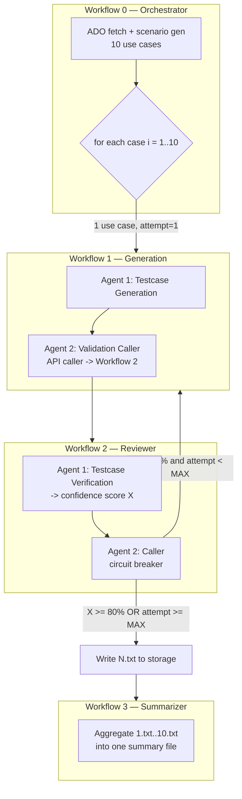

# Self-Healing Agent Workflows — Project Design (v2)

This workspace implements a **self-healing test-generation system** for EDI 834 inbound
processing, built on the AAVA agent platform. The system is organized as **four cooperating
workflows** (`workflow0`–`workflow3`) driven by a **confidence-based circuit breaker** that
re-triggers generation until the reviewer is confident, then persists and summarizes results.

> **Design status:** This document describes the **target v2 architecture**. The repository
> still contains the **v1 folders** (`workflow1/`, `workflow2/`) and caller scripts from the
> previous two-workflow design. The v1 snapshot is preserved in
> [`backup/`](../backup/) (`design-v1_selfhealing_*.zip` and `copilot-instructions.v1.md`).
> Do **not** delete v1 folders until the v2 restructure is explicitly approved.

## Architecture at a glance

## Workflows

### Workflow 0 — Orchestrator (`workflow0/`)
Owns the **outer loop over all 10 use cases**.
- Performs **ADO fetch** and **test scenario generation** (the responsibilities that lived in
  the v1 Workflow 1's ADO Fetcher + Scenario Gen agents now belong here).
- Iterates the 10 cases and **calls Workflow 1 once per case**, passing a **single use case**
  plus loop state (`caseIndex` 1..10 and `attempt = 1`).

### Workflow 1 — Generation (`workflow1/`)
Generates test cases for **one** use case, then hands off for review.
1. **Agent 1 — Testcase Generation** — generates test cases from the single incoming use case.
2. **Agent 2 — Validation Caller (API caller)** — calls **Workflow 2** (the reviewer) with the
   generated output, forwarding `caseIndex` and `attempt`.

### Workflow 2 — Reviewer (`workflow2/`)
Reviews generated output and decides whether to heal, persist, or aggregate.
1. **Agent 1 — Testcase Verification** — verifies the test cases and produces a **confidence
   score `X` (0–100)**.
2. **Agent 2 — Caller (circuit breaker)** — acts on `X`:
   - **`X < 80%` and not at retry cap → re-call Workflow 1** (self-healing loop) with
     `attempt + 1`.
   - **`X >= 80%` (or retry cap reached) → Write the case output to storage as `N.txt`**, then
     **call Workflow 3**.

### Workflow 3 — Summarizer (`workflow3/`)
- Triggered **per passing case** by Workflow 2 after `N.txt` is written.
- **Aggregates** the individual case files (`1.txt`, `2.txt`, … `10.txt`) into **one summary
  file**. The final summarization reflects all cases completed so far; the complete summary is
  available once all 10 cases have been written.

## Circuit breaker — how the retry loop is bounded

AAVA re-invokes a workflow through a **stateless HTTP call**, so there is no shared memory
between attempts. The retry loop is bounded by **threading an attempt counter through the
payload**:

- Workflow 0 seeds each case with **`attempt = 1`** in `userInputs`.
- Workflow 1's Validation Caller forwards the current `attempt` to Workflow 2.
- Workflow 2's Caller checks `attempt` **before** re-triggering:
  - `attempt >= _MAX_ITERATIONS` → **circuit opens**: stop retrying and take the persist path
    (write best-effort `N.txt`, call Workflow 3) so the case completes instead of looping.
  - otherwise, when `X < 80%`, re-call Workflow 1 with `attempt + 1`.

**Defaults (override as needed):**
- `_MAX_ITERATIONS = 3` (hard cap on re-generation attempts per case).
- Circuit-open behavior = **write best-effort `N.txt`** and continue (not "mark failed / skip").

## Confidence logic
- `score <= 30` → **abort**: treated as no valid reviewer confidence; workflow is NOT
  re-triggered (retained from v1 as a second guard).
- `score >= 80` (`_CONFIDENCE_THRESHOLD`) → **persist path**: write `N.txt` + call Workflow 3.
- `30 < score < 80` → **re-trigger Workflow 1** (subject to the `_MAX_ITERATIONS` cap above).

## Caller tools

The v1 self-healing caller (`RestApiFormDataCaller`) is the basis for the v2 callers:
- Implementation: [`wf_caller_tool.py`](../wf_caller_tool.py) (crewai `BaseTool`, used inside AAVA).
- Standalone runnable copy: [`wf_caller_run.py`](../wf_caller_run.py) (no crewai/AVASecret
  deps; run with `python wf_caller_run.py`, supports `DRY_RUN`).

v2 introduces **two caller roles** (may be the same tool parameterized by target `pipelineId`):
- **Workflow 1 → Workflow 2** (Validation Caller).
- **Workflow 2 → Workflow 1 / Workflow 3** (circuit-breaker Caller).

### Inputs
- `form_data`: `pipelineId` (int) + `userInputs` dict. `userInputs` carries the payload plus
  **loop state** (`caseIndex`, `attempt`). The agent must **not** send `priority`.
- `confidence_score`: reviewer confidence, 0–100 (Workflow 2 caller only).

### Behavior notes
- `priority` is always hardcoded to `1` (`_PRIORITY`); it is never taken from the agent.
- AAVA substitutes `{{var}}` tokens in prompts, so `userInputs` keys are re-keyed to the
  target workflow's variable names (e.g. `tsInputJson_string_true`,
  `rvwFeedbackTxt_string_false`, `reviewinputs`, plus new loop keys for `caseIndex`/`attempt`).
- All form-data values are normalized to strings; nested dicts/lists are JSON-serialized.

## Storage / persistence target
- Per-case outputs are written as `N.txt` (`1.txt` … `N.txt`, keyed by `caseIndex`);
  Workflow 3 aggregates them.
- **Target = a GitHub repo.** The writer tool commits each `N.txt` to **one stable output
  branch** (`_OUTPUT_BRANCH`, default `self-healing-testcases`), **appending** to the branch
  and auto-creating it from base if missing, so all passing cases land together. A short
  ref-update retry guards against concurrent per-case writers.
- Implementation: [`wf_github_writer_tool.py`](../wf_github_writer_tool.py) (AAVA `GithubWriterTool`,
  hardcoded creds) and [`wf_github_writer_run.py`](../wf_github_writer_run.py) (standalone,
  `.env`: `GITHUB_TOKEN`, `GITHUB_REPO_OWNER`, `GITHUB_REPO_NAME`, `GITHUB_BASE_BRANCH`,
  `GITHUB_OUTPUT_BRANCH`). Tool input is a `files` dict, e.g. `{"5.txt": "<approved cases>"}`.
- **Still TBD:** actual repo owner/name, base branch, and token value.

## Open decisions (track until resolved)
- `_MAX_ITERATIONS` value (default `3`) and circuit-open behavior (default: best-effort write).
- Storage target details (GitHub repo path/branch/auth) for the Write-to-storage tool.
- Whether v2 keeps separate prompt folders per workflow or shares prompts (see sync rule below).

## Conventions & guardrails (ALWAYS ENFORCE)
- **PAT / credential handling is intentional and stays this way — do NOT "fix" it:**
  - Standalone runnables (`wf_*_run.py`) read secrets/config from a `.env` file / environment
    (`AAVA_TOKEN`, `GITHUB_TOKEN`, `GITHUB_REPO_*`).
  - AAVA tools (`wf_*_tool.py`) keep the PAT/creds **hardcoded** in the script.
  - This split is by design. Do not move the hardcoded token out of the tool scripts and do
    not flag it as an issue.
- **Keep the caller scripts in sync at all times:** each tool exists as an AAVA `BaseTool`
  and a standalone runnable that must share identical core logic (thresholds, retry caps,
  payload mapping, `userInputs` re-keying, branch strategy). If one changes, update its twin in
  the same edit — the ONLY allowed difference is credential handling (below). The pairs are:
  - `wf_caller_tool.py` ⇄ `wf_caller_run.py` (reviewer circuit-breaker caller)
  - `wf_scenario_fanout_tool.py` ⇄ `wf_scenario_fanout_run.py` (scenario fan-out)
  - `wf_github_writer_tool.py` ⇄ `wf_github_writer_run.py` (GitHub writer)
- **Keep any duplicated agent prompts in sync:** if a prompt (e.g. Test Case Gen or Reviewer)
  is duplicated across workflow folders for clarity, the copies represent the same underlying
  agent and MUST be updated identically so they never drift apart.
- Agent prompt files are plain `.txt` and are the source of truth for each agent's behavior.
- **Preserve the v1 backup:** do not modify or delete anything under [`backup/`](../backup/).
